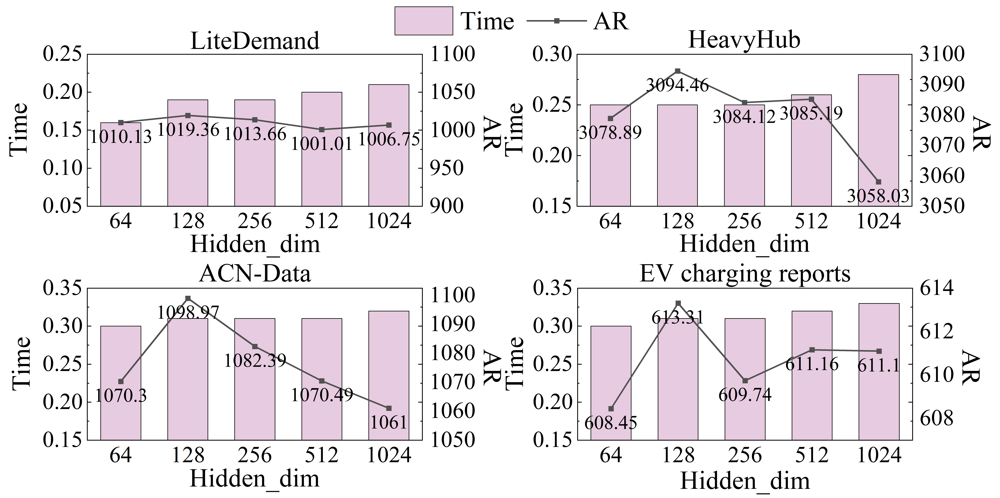
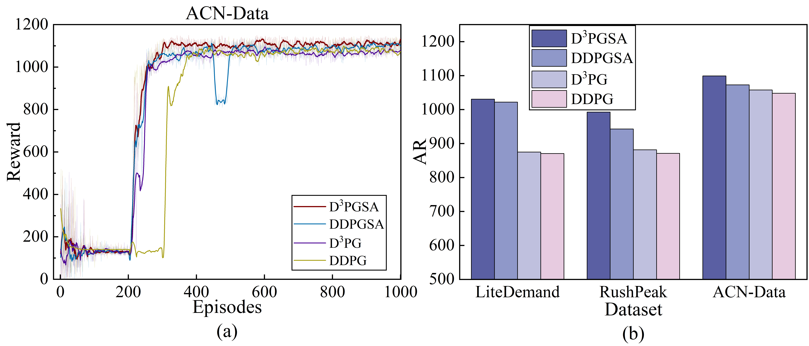

# D³PGSA: A Dual-value Deep Deterministic Policy Gradient based on Sample Augmentation for Dynamic Pricing of EV Charging Station

This repository provides the code, dataset, and experimental results for our paper:

> **D³PGSA: A Dual-value Deep Deterministic Policy Gradient based on Sample Augmentation for Dynamic Pricing of EV Charging Station**  
> Status: Submitted to IEEE Transactions on Intelligent Transportation Systems, In Revision.

---

## Overview

This project addresses the dynamic pricing problem for electric vehicle charging stations (EVCS) under uncertain and dynamic demand conditions.  
We propose D³PGSA, an enhanced reinforcement learning framework that integrates experience generation, feature-based DBSCAN clustering, and a dual-critic architecture to improve policy learning effectiveness.

The repository includes:
- The implementation of D³PGSA.
- Datasets.
- Training, evaluation, and result reproduction instructions.
- Key experimental results.

---

## Repository Structure

```text
D3PGSA/
├── README.md               # Project overview and instructions
│   
├── Code/
│   ├── D3PGSA.ipynb             
│   ├── chargenv.py             
│   ├── EV.py                 
│   └── Comparison_Algorithm/
├── datasets/
│   ├── ACN-Data.csv               
│   └── EV Charging Reports.csv           
├── Results/
├── Images/
└── requirements.txt
```
---


## 🔧 Running the Code

### 1. Environment Setup

Install all required Python packages using:

```bash
pip install -r requirements.txt
```
---
### 2. Data Preparation

Please ensure your dataset is stored at:

```bash
./datasets/{dataset_name}.csv
```
---

### 3. Start Training

```bash
python D3PGSA.ipynb
```
Please modify the dataset name and Num_data in the script before execution, to ensure:

The correct dataset file is loaded from ./datasets/{dataset_name}.csv

Model parameters are saved with the correct identifier

During testing, the correct model checkpoint can be reloaded

For example, change these lines in the script:

```bash
Num_data = 6
dataset = 'EV Charging Reports'
data_path = './datasets/{}.csv'.format(dataset)
```

The training includes:

Actor-Critic model with dual Q-networks

Experience generation and clustering using simsiam + DBSCAN

Adaptive exploration via noise decay

Soft updates and performance monitoring

---
### 4. Key Configurations
Modify the following variables in the script as needed:
| Parameter        | Description                          | Example      |
|------------------|--------------------------------------|--------------|
| `Num_data`       | Number of each dataset               | `6`          |
| `num_episodes`   | Total training episodes              | `1000`       |
| `action_bound`   | Max charging power per time slot     | `0.5`        |
| `buffer_size`    | Size of replay buffer                | `40000`      |
| `sigma`          | Initial exploration noise (Gaussian) | `0.5`        |
| `critic_lr`      | Learning rate of critic              | `0.002`      |
| `actor_lr`       | Learning rate of actor               | `0.002`      |
| `gamma`       | Decay factor               | `0.98`      |
| `tau`       | Soft update parameter               | `0.001`      |
| `batch_size`       | Experience sample size               | `128`      |
### 5. Outputs
After training, the following files are generated:
| Output Type    | Path                                                | Description                        |
|----------------|-----------------------------------------------------|------------------------------------|
| Trained Actor  | `./model/actor_D3PGSA{}.pth`                       | Best actor model checkpoint        |
| Training Log   | `./result/train/D3PGSA{}.csv`                      | Episode returns saved as `.csv`   |
| Training Curve | Shown via `matplotlib.pyplot`                      | Return vs. episode plot            |
### 6. Evaluate Trained Model
```bash
agent.actor.load_state_dict(torch.load('./model/actor_D3PGSA{}.pth'))

```
Then interact with the environment using env.step().

# 💡Statement of Major Changes in Experimental Results due to Dataset Modification

We have comprehensively updated and restructured all experimental datasets used in the original submission. These updates involve the inclusion of two additional real-world datasets, the reconstruction of four synthetic datasets, and a refinement of the temporal resolution in processing vehicle charging events to more accurately capture realistic charging behaviors. These modifications have resulted in notable changes to the input distributions and scenario configurations. Consequently, all experimental results—including performance metrics, tables, and figures—have been fully re-generated. These updates stem solely from adjustments to the experimental design, with the proposed methodology itself remaining unchanged.

# Experimental Results

This section presents key experimental results from our study, including training dynamics, comparative evaluations, and statistical analyses.

---

## 1. Training Dynamics

The performance of D³PGSA during training is shown below.

### 1.1 Training Reward Curves


*Figure 1: Reward curve of D³PGSA and other algorithms over epochs.*

---

  ### 1.2  Solution Time Curves 


*Figure 2: Solution time curves of D³PGSA and heuristic algorithms.*

---

## 2. Algorithm Performance Comparison

Performance comparisons between D³PGSA and other algorithms on different datasets are presented.

### 2.1 Comparison Experiment

### 📊 Table: Comparative Experimental Results of Different Algorithms on Six Datasets

| Dataset        | Metric | GWO           | WSO         | NSGAII     | DDPG      | TD3         | DSAC       | **D³PGSA**         |
|----------------|--------|---------------|------------------|----------------|------------------|------------------|------------------|--------------------|
| **LiteDemand** | AR     | 788.37±6.00   | 938.54±46.05     | 867.57±111.66  | 870.46±2.34      | 806.85±5.12      | 1014.94±1.53     | **1029.73±0.98**   |
|                | WDG    | 1.20%±1.66%   | 20.47%±6.02%     | 11.17%±12.41%  | 11.75%±2.50%     | 3.58%±1.86%      | 30.31%±3.10%     | **32.20%±2.93%**   |
|                | TWREI  | 0.03±0.05     | 0.67±0.18        | 0.41±0.40      | 0.76±0.04        | 0.42±0.05        | 1.32±0.01        | **1.34±0.01**      |
| **HeavyHub**   | AR     | 2523.27±11.02 | 2825.37±72.15    | 2897.31±231.30 | 2750.26±14.16    | 2757.03±22.38    | 3083.47±1.57     | **3093.64±1.63**   |
|                | WDG    | 0.00%±0.00%   | 11.98%±3.01%     | 14.80%±8.75%   | 9.00%±0.60%      | 9.27%±0.44%      | 22.20%±0.58%     | **22.61%±0.52%**   |
|                | TWREI  | 0.01±0.01     | 0.54±0.14        | 0.68±0.38      | 0.80±0.02        | 0.71±0.02        | 1.31±0.01        | **1.35±0.01**      |
| **RushPeak**   | AR     | 937.93±4.26   | 782.38±18.61     | 918.65±35.04   | 869.78±1.34      | 833.69±1.41      | 958.28±4.40      | **992.09±0.75**    |
|                | WDG    | 19.93%±2.57%  | 0.00%±0.00%      | 17.51%±6.22%   | 11.22%±2.66%     | 6.60%±2.50%      | 22.54%±3.12%     | **26.86%±2.92%**   |
|                | TWREI  | 0.74±0.02     | 0.03±0.01        | 0.68±0.20      | 0.81±0.06        | 0.62±0.07        | 1.20±0.03        | **1.33±0.01**      |
| **OffValley**  | AR     | 700.75±1.27   | 718.77±60.22     | 659.70±63.70   | 795.65±1.42      | 806.63±1.94      | 809.80±4.26      | **836.57±0.76**    |
|                | WDG    | 8.86%±6.39%   | 11.53%±10.09%    | 2.05%±4.10%    | 23.61%±7.26%     | 25.31%±7.20%     | 25.83%±7.89%     | **29.96%±7.63%**   |
|                | TWREI  | 0.26±0.17     | 0.41±0.29        | 0.14±0.20      | 1.13±0.07        | 1.23±0.06        | 1.23±0.05        | **1.32±0.02**      |
| **ACN-Data**   | AR     | 978.54±6.05   | 1024.21±43.03    | 999.18±39.98   | 1047.16±1.13     | 1035.25±1.60     | 1084.22±4.28     | **1097.63±1.01**   |
|                | WDG    | 0.95%±1.37%   | 5.64%±3.92%      | 3.04%±2.94%    | 8.03%±1.32%      | 6.80%±1.26%      | 11.85%±1.37%     | **13.24%±1.32%**   |
|                | TWREI  | 0.07±0.09     | 0.46±0.32        | 0.28±0.24      | 0.97±0.05        | 0.91±0.04        | 1.24±0.03        | **1.34±0.01**      |
| **EV Reports** | AR     | 528.47±2.36   | 533.29±3.66      | 542.70±9.10    | 589.85±0.83      | 577.23±0.61      | 616.73±0.75      | **618.75±0.56**    |
|                | WDG    | 0.00%±0.00%   | 0.91%±0.34%      | 2.70%±2.00%    | 11.61%±0.42%     | 9.23%±0.51%      | 16.70%±0.49%     | **17.09%±0.48%**   |
|                | TWREI  | 0.01±0.01     | 0.07±0.02        | 0.18±0.13      | 1.04±0.02        | 0.94±0.02        | 1.32±0.02        | **1.34±0.01**      |


---

### 2.2 Statistical Significance Test
### 🧪 Table IV. Statistical Significance Test Results of D³PGSA Against Other Algorithms on the AR Metric

| Dataset         | Metric      | GWO        | WSO   | NSGAII | DDPG  | TD3   | DSAC  |
|-----------------|-------------|------------|-----------|------------|-----------|-----------|-----------|
| **LiteDemand**  | t-value     | 88.7959    | 4.4266    | 3.2474     | 140.4631  | 95.5044   | 18.1822   |
|                 | p-value     | 2.89E-13   | 0.0022    | 0.0117     | 7.38E-15  | 1.61E-13  | 8.60E-08  |
|                 | stat. sig.  | ✔          | ✔         | ✔          | ✔         | ✔         | ✔         |
| **HeavyHub**    | t-value     | 114.4821   | 8.3116    | 1.9241     | 171.7188  | 261.0113  | 10.0433   |
|                 | p-value     | 3.79E-14   | 3.31E-05  | 0.0905     | 1.48E-15  | 5.20E-17  | 8.22E-06  |
|                 | stat. sig.  | ✔          | ✔         | ✘          | ✔         | ✔         | ✔         |
| **RushPeak**    | t-value     | 27.9875    | 25.1695   | 4.6857     | 178.6859  | 222.1023  | 16.9924   |
|                 | p-value     | 2.87E-09   | 6.65E-09  | 0.0016     | 1.08E-15  | 1.89E-16  | 1.51E-07  |
|                 | stat. sig.  | ✔          | ✔         | ✔          | ✔         | ✔         | ✔         |
| **OffValley**   | t-value     | 205.6329   | 4.3737    | 6.2083     | 56.8720   | 32.1750   | 13.8493   |
|                 | p-value     | 3.50E-16   | 0.0024    | 0.0003     | 1.01E-11  | 9.48E-10  | 7.14E-07  |
|                 | stat. sig.  | ✔          | ✔         | ✔          | ✔         | ✔         | ✔         |
| **ACN-Data**     | t-value     | 43.4158    | 3.8145    | 5.5052     | 74.4298   | 73.6775   | 6.8164    |
|                 | p-value     | 8.74E-11   | 0.0051    | 0.0006     | 1.18E-12  | 1.2E-12   | 0.0000    |
|                 | stat. sig.  | ✔          | ✔         | ✔          | ✔         | ✔         | ✔         |
| **EV Reports**  | t-value     | 83.4531    | 51.6073   | 18.6517    | 64.9579   | 112.3183  | 4.9098    |
|                 | p-value     | 4.74E-13   | 2.2E-11   | 7.05E-08   | 3.51E-12  | 4.41E-14  | 0.0012    |
|                 | stat. sig.  | ✔          | ✔         | ✔          | ✔         | ✔         | ✔         |

---
### 2.3 Confidence Interval
### 📐 Table V. Confidence Intervals of AR and TWREI in the Comparative Experiments

| Dataset           | Metric  | GWO              | WSO          | NSGAII        | DDPG          | TD3         | DSAC         | **D³PGSA**          |
|-------------------|---------|------------------|-------------------|--------------------|--------------------|-------------------|-------------------|---------------------|
| **LiteDemand**    | AR      | 788.37 ± 7.45    | 938.54 ± 57.18    | 867.57 ± 138.64    | 870.46 ± 2.90      | 806.85 ± 6.36     | 1014.94 ± 1.90    | **1029.73 ± 1.22**  |
|                   | TWREI   | 0.03 ± 0.06      | 0.67 ± 0.22       | 0.41 ± 0.50        | 0.76 ± 0.05        | 0.42 ± 0.06       | 1.32 ± 0.02       | **1.34 ± 0.01**     |
| **HeavyHub**      | AR      | 2523.27 ± 13.68  | 2825.37 ± 89.59   | 2897.31 ± 287.20   | 2750.26 ± 5.17     | 2757.03 ± 2.95    | 3083.47 ± 1.95    | **3093.64 ± 2.02**  |
|                   | TWREI   | 0.01 ± 0.02      | 0.54 ± 0.17       | 0.68 ± 0.47        | 0.80 ± 0.02        | 0.71 ± 0.02       | 1.31 ± 0.02       | **1.35 ± 0.01**     |
| **RushPeak**      | AR      | 937.93 ± 5.29    | 782.38 ± 23.11    | 918.65 ± 43.50     | 869.78 ± 1.66      | 833.69 ± 1.75     | 958.28 ± 5.47     | **992.09 ± 0.93**   |
|                   | TWREI   | 0.74 ± 0.03      | 0.03 ± 0.01       | 0.68 ± 0.24        | 0.81 ± 0.07        | 0.62 ± 0.08       | 1.20 ± 0.04       | **1.33 ± 0.01**     |
| **OffValley**     | AR      | 700.75 ± 1.57    | 718.77 ± 74.78    | 659.70 ± 79.09     | 795.65 ± 1.76      | 806.63 ± 2.40     | 809.80 ± 5.28     | **836.57 ± 0.94**   |
|                   | TWREI   | 0.26 ± 0.20      | 0.41 ± 0.35       | 0.14 ± 0.25        | 1.14 ± 0.07        | 1.24 ± 0.04       | 1.22 ± 0.09       | **1.32 ± 0.02**     |
| **ACN-Data**      | AR      | 978.54 ± 7.51    | 1024.21 ± 53.43   | 999.18 ± 49.64     | 1047.16 ± 1.41     | 1035.25 ± 1.99    | 1084.22 ± 5.32    | **1097.63 ± 1.25**  |
|                   | TWREI   | 0.07 ± 0.11      | 0.46 ± 0.40       | 0.28 ± 0.29        | 0.97 ± 0.06        | 0.91 ± 0.05       | 1.24 ± 0.03       | **1.34 ± 0.01**     |
| **EV Reports**    | AR      | 528.47 ± 2.92    | 533.29 ± 4.55     | 542.70 ± 11.30     | 589.85 ± 1.03      | 577.23 ± 0.76     | 616.73 ± 0.95     | **618.79 ± 0.69**   |
|                   | TWREI   | 0.01 ± 0.01      | 0.07 ± 0.02       | 0.18 ± 0.16        | 1.04 ± 0.02        | 0.94 ± 0.02       | 1.32 ± 0.02       | **1.34 ± 0.02**     |


## 3. Additional Results  and Visualizations

Complementary visualizations provide further insights into the experimental outcomes.

### 3.1 Hyperparameter Experiments

We mainly performed the following hyperparametric experiments:

- Learning rate `lr` of actor and critic
- Hidden layer size `hidden_dim`
  
### 3.1 Hyperparameter Ablation Study: Learning Rate Sensitivity

The following table presents the performance of D³PGSA under different learning rate values across four representative datasets. The best results for each row are highlighted in **bold**.

| Dataset                | Metric | 0.0001  | 0.0005  | 0.001   | 0.002    | 0.005   |
|------------------------|--------|---------|---------|---------|----------|---------|
| **LiteDemand**         | AR     | 925.07  | 992.00  | 1013.27 | **1030.7** | 999.41  |
|                        | WDG    | 0.00%   | 7.23%   | 9.53%   | **11.42%** | 8.04%   |
|                        | TAR    | 327.84  | 598.06  | 859.41  | **904.34** | 821.12  |
|                        | TTC    | -       | 72.76   | 60.69   | 43.52     | **43.18**  |
| **HeavyHub**           | AR     | 2746.44 | 3022.62 | 3078.66 | **3094.46** | 3080.94 |
|                        | WDG    | 0.00%   | 10.07%  | 12.10%  | **12.67%** | 12.18%  |
|                        | TAR    | 1634.77 | 2379.28 | 2505.11 | **2550.65** | 2077.65 |
|                        | TTC    | -       | 77.74   | 73.06   | **69.42**  | 105.82  |
| **ACN-Data**           | AR     | 1035.39 | 1044.80 | 1079.03 | **1098.97** | 1081.01 |
|                        | WDG    | 0.00%   | 0.91%   | 4.22%   | **6.14%**  | 4.41%   |
|                        | TAR    | 702.19  | 795.98  | 870.34  | **960.39** | 870.65  |
|                        | TTC    | 87.42   | **66.96** | 73.16   | 68.82     | 78.74   |
| **EV charging reports**| AR     | 598.31  | 609.27  | 608.98  | **619.56** | 613.55  |
|                        | WDG    | 0.00%   | 1.83%   | 1.78%   | **3.55%**  | 2.55%   |
|                        | TAR    | 396.97  | 435.45  | **474.94** | 442.63     | 376.14  |
|                        | TTC    | **70.06** | 106.64 | 97.73   | 87.03     | 101.68  |



*Figure 3: Experimental results with varying numbers of hidden neurons.*

### 3.2 Ablation Experiments



*Figure 4: Ablation experiment results*

