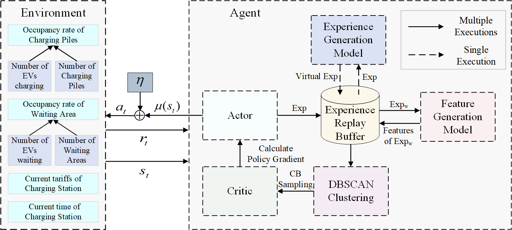
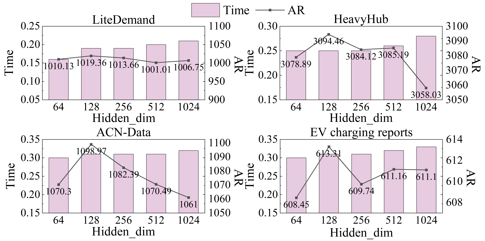

# D³PGSA: A Dual-value Deep Deterministic Policy Gradient based on Sample Augmentation for Dynamic Pricing of EV Charging Station

This repository provides the code, dataset, and experimental results for our paper:

> **D³PGSA: A Dual-value Deep Deterministic Policy Gradient based on Sample Augmentation for Dynamic Pricing of EV Charging Stations**  
> Status: Submitted to IEEE Transactions on Intelligent Transportation Systems, In Revision.

---

## Overview

This project addresses the dynamic pricing problem for electric vehicle charging stations (EVCS) under uncertain and dynamic demand conditions.  
We propose D³PGSA, an enhanced reinforcement learning framework that integrates experience generation, feature-based DBSCAN clustering, and a dual-critic architecture to improve policy learning effectiveness.

The repository includes:
- The implementation of D³PGSA.
- Datasets.
- Training, evaluation, and result reproduction instructions.
- Key experimental results.

---

## Repository Structure

```text
D3PGSA_EVCS_DynamicPricing/
├── README.md               # Project overview and instructions
│   
├── Code/
│   ├── D3PGSA.ipynb              # Main training and testing script
│   ├── chargenv.py             # D³PGSA model implementation
│   └── EV.py    # Python environment dependencies
├── Data/
│   ├── ACN-Data.csv               
│   └── EV Charging Reports.csv           
├── Results/
│   └── Figures/                
└── requirements.txt
```
---

# Experimental Results

This section presents key experimental results from our study, including training dynamics, comparative evaluations, and statistical analyses.

---

## 1. Training Dynamics

The learning behavior of D³PGSA during training is illustrated below.

### 1.1 Training Loss Curve



*Figure 1: Training loss curve of D³PGSA over epochs. A steady convergence trend is observed, indicating stable learning.*

---

### 1.2 Policy Evaluation Scores



*Figure 2: Policy evaluation scores during training episodes, reflecting policy improvement across time.*

---

## 2. Comparative Performance Across Algorithms

Performance comparisons between D³PGSA and baseline algorithms on different datasets are presented.

### 2.1 LiteDemand Dataset


*Figure 3: Average revenue achieved by different algorithms on the LiteDemand dataset. D³PGSA outperforms all baselines.*

---

### 2.2 HeavyHub Dataset


*Figure 4: Average revenue comparison on the HeavyHub dataset under high-demand conditions.*

---

## 3. Quantitative Results

The following tables summarize detailed performance metrics across algorithms.

### 3.1 Average Revenue (AR)

| Dataset        | GWO (AR)        | WSO (AR)        | DDPG (AR)       | TD3 (AR)        | DSAC (AR)       | D³PGSA (AR)         |
|----------------|-----------------|-----------------|-----------------|-----------------|-----------------|---------------------|
| LiteDemand     | 788.37 ± 6.00    | 938.54 ± 46.05   | 870.46 ± 2.34    | 806.85 ± 5.12    | 1014.94 ± 1.53   | **1029.73 ± 0.98**   |
| HeavyHub       | ...             | ...             | ...             | ...             | ...             | ...                 |

*Table 1: Average Revenue (AR) results across datasets. Bold values indicate the best-performing method.*

---

### 3.2 Time-Weighted Reward Efficiency Index (TWREI)

| Dataset        | GWO (TWREI) | WSO (TWREI) | DDPG (TWREI) | TD3 (TWREI) | DSAC (TWREI) | D³PGSA (TWREI)     |
|----------------|-------------|-------------|-------------|-------------|-------------|--------------------|
| LiteDemand     | 0.03 ± 0.06  | 0.01 ± 0.02  | 0.05 ± 0.01  | 0.02 ± 0.01  | 0.01 ± 0.00  | **0.01 ± 0.00**    |
| HeavyHub       | ...         | ...         | ...         | ...         | ...         | ...                |

*Table 2: Time-Weighted Reward Efficiency Index (TWREI) results. Lower values indicate better efficiency.*

---

## 4. Additional Visualizations

Complementary visualizations provide further insights into the experimental outcomes.

### 4.1 Scatter Plot of Test Results


*Figure 5: Scatter plot showing the distribution of revenues across various test scenarios.*

---

### 4.2 Charging Demand Distribution


*Figure 6: Histogram of charging demand distribution, illustrating peak and valley periods.*

---
